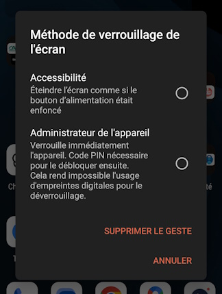
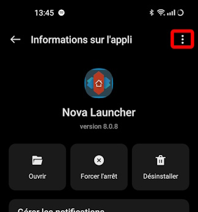
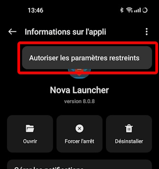

Je viens d'upgrader mon smartphone (OnePlus 8T) sur Android 14 et je me suis confronté à un problème de paramètre restreint sur une de mes applications préférées.

En effet, j'utilise une application tiers comme launcher combinée au `double appui` pour éteindre l'écran. Et c'est sur cette action que je voyais apparaitre l'erreur en question.

# Erreur rencontrée

Ainsi après avoir upgradé vers Android 14, en faisant le `double appui` sur une zone vide l'écran, au lieu que celui-ci ne s'éteigne, le message suivant était visible.

# Comment la résoudre et autoriser ce paramètre d'accessibilité

Cela pourrait être simple mais non, il n'est pas possible de modifier ce paramètre en se laissant guider depuis la précédente erreur.

Pour accèder au réglage de ce paramètre d'accessibilité d'Android, il est nécessaire de passer par un chemin bien précis.

* Ouvrir les `Paramètres` de l'appareil
* Choisir `Applications`
* Sélectionner `Gestion d'applis`
* Rechercher l'application impactée
* Repérer les 3 petits points en haut à droite

* Cliquer dessus

* Confirmer l'action avec votre moyen de protection
* Un petit message vous indique que la restriction est levée et les 3 petits points ont disparus

La restriction est maintenant levée, je peux utiliser mon application comme précédemment.