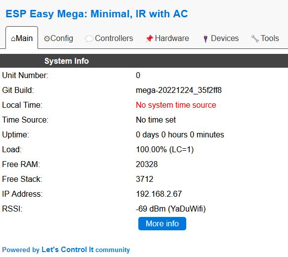
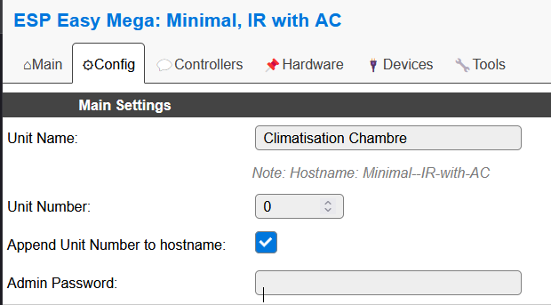
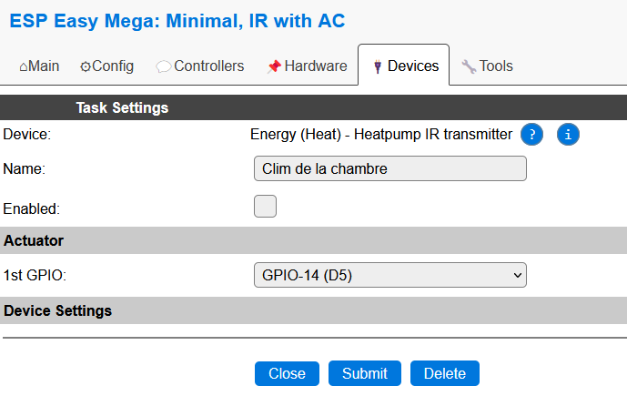

Cette page s'inscrit dans une opération plus globale qui consiste à inclure un module esp8266 dans le plugin ESPEasy de Jeedom. Sa fonctionnalité sera de servir d'émetteur IR pour contrôler une unité intérieure d'une climatisation.

Cette étape permet d'inclure un module ESP8266 dans Jeedom avec le pluggin ESPEasy

# Paraméter l'ESP8266 pour l'inclure dans jeedom

Cette étape permet de préparer l'ESP8266 pour qu'il puisse être inclut dans le pluggin EspEasy dans Jeedom.

* Depuis un navigateur web, taper l'url : `http://<IP_CHOISIE_DE_L_ESP8266>`
Vous devriez voir une page ressemblant à cela.

* Changer son nom de façon à vous y retrouver en cliquand sur l'onglet `Config`

* Pour synchroniser l'heure, il est possible d'activer un serveur NTP.
Pour cela, cliquer l'onglet `Tools` et le bouton `Advanced`.
Enfin, activer `NTP` et vous pouvez mettre le serveur `ntp.midway.ovh`.

# Inclure l'équipement dans jeedom

Cette étape permet de faire remonter le nouvel équipement dans le plugin EspEasy. Pour cela,

## Préparer Jeedom

* Se connecter à Jeedom
* Se rendre sur la page du plugin EspEasy
* Choisir le menu `Configuration` pour récupérer les informations du controler, à savoir :
  * controller ip,
  * controller port et
  * controller Publish

* Ensuite lancer le mode inclusion

## Forcer l'inclusion

Maintenant il est nécessaire de forcer l'envoi d'une trame HTTP vers Jeedom. Pour cela,

* Se connecter à la page du weemos
* Cliquer sur l'onglet `Controllers`, cliquer sur `Add`
* Choisir dans la liste déroulante `Generic HTTP`
* Saisir dans le formulaire, les champs :
  * Controller IP -> IP de votre jeedom
  * Controller Port -> PORT de votre jeedom (8121)
  * Controller publish -> la commande fournie
* Cocher la case `Enabled`
* Cliquer `Submit` puis `Close`

* Sélectionner l'onglet `Devices`
* Créer un nouveau device
* Choisir `Generic` puis `System Info`
* Dans `value 1`, mettre le `Wifi RSSI`
* Cocher `Send to controller`
* Cocher la case `Enabled`

* Retourner sous Jeedom
* Confirmer qu'un nouvel équipement est présent
* Désactiver l'inclusion
* Désactiver le device en décochant la case `Enabled`

# Paramétrer la fonction IR pour Jeedom

