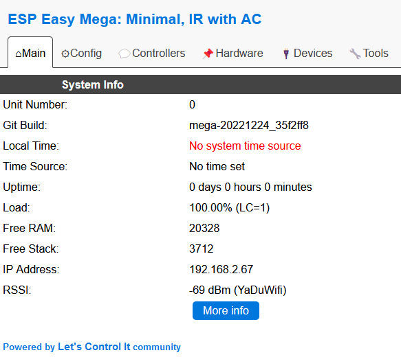

Cette page s'inscrit dans une opération plus globale qui consiste à inclure un module ESP8266 dans le plugin ESPEasy de Jeedom. Sa fonctionnalité sera de servir d'émetteur IR pour contrôler une unité intérieure d'une climatisation.

Cette 2de étape permet d'associer l'ESP8266 à une connexion wifi.

# Association au Wifi

Rien de bien sorcier, il suffit d'être méthodique. Aussi, je vous propose de suivre les étapes suivantes.

* L'ESP8266 doit être branché et activé.
* A l'aide de votre ordinateur ou smartphone,
  * ouvrir le gestionnaire de Wifi,
  * faire une recherche dans les wifis disponibles de celui qui porte le nom du firmware précédement flashé dans l'ESP8266 (dans mon cas, il s'agit de `Minimal--IR-with-AC`),
  * et s'y connecter en utilisant le mot de passe par défaut : `configesp`

  

* Depuis un navigateur web, taper l'url : `http://192.168.4.1/setup`

Une page vous permet de sélectionner un wifi auquel se connectera l'ESP8266

* Au travers du formulaire, renseigner les infos relatives à votre connexion wifi
* Une fois avoir valider, il est nécessaire d'attendre quelques secondes
* Vous allez etre reconnecté à votre wifi par défaut et la page sera vide ou avec une erreur

A ce niveau, votre ESP8266 est maintenant associé à votre Wifi comme tout autre équipement.

# Adresse IP fixe

De façon à pouvoir l'utiliser dans un projet domotique, il est nécessaire de lui associer une IP fixe. Pour cela,

* Ouvrir la page de configuration de votre box ou routeur,
* Sélectionner dans le menu, l'option vous permettant d'accéder aux paramètres DHCP
* Identifier l'équipement connecté à votre wifi avec le nom du firmware (par exemple, `Minimal--IR-with-AC`)
* Et lui attribuer une IP qui fait sens dans votre projet
* Ne pas oublier d'enregistrer les modifications dans la box
* Débrancher et rebrancher l'ESP8266 de façon à ce qu'il puisse prendre la nouvelle IP

# Paraméter l'ESP8266

Cette étape permet de préparer l'ESP8266 aux fins que vous lui destinez.

* Depuis un navigateur web, taper l'url : `http://<IP_CHOISIE_DE_L_ESP8266>`
Vous devriez voir une page ressemblant à cela.

* Changer son nom de façon à vous y retrouver en cliquand sur l'onglet `Config`

* Pour synchroniser l'heure, il est possible d'activer un serveur NTP.
Pour cela, cliquer l'onglet `Tools` et le bouton `Advanced`.
Enfin, activer `NTP` et vous pouvez mettre le serveur `ntp.midway.ovh`.

> Le module ESP8266 est maintenant connecté à votre wifi et il est prêt à être paramétrer en fonction de vos besoins.

# Sources

Pour m'aider à appréhender tout cela, je me suis appuyer sur la page suivante. Merci à son auteur.

* [Configuration et présentation de ESPeasy Mega](https://projetasgarddiy.fr/2018/05/24/configuration-de-espeasy-mega/)
